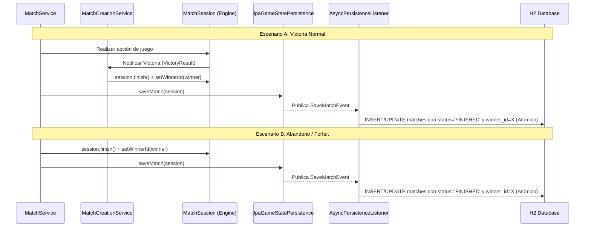

# Diseño de Persistencia Atómica del Ganador

Este documento detalla el análisis de diseño y la solución técnica definitiva implementada en el proyecto para persistir el ganador de las partidas (`winner_id`), resolviendo de raíz las inconsistencias funcionales y las condiciones de carrera concurrentes (race conditions).

---

## 1. Diagnóstico de las Alternativas Evaluadas

Durante el proceso de diseño y auditoría de la FASE 4, se evaluaron tres estrategias posibles para implementar la persistencia del ganador:

### Alternativa A: Persistencia Unificada y Atómica en `onSaveMatch` (Solución Adoptada)
Consiste en delegar en `MatchSession` la responsabilidad de conocer al ganador al finalizar la partida (tanto en victorias por motor de juego como en abandonos por desconexión) y persistir todo el registro junto con el ganador en una única transacción en la base de datos a través de `SaveMatchEvent`.

* **Ventajas:**
  * **Atomicidad total:** El estado de la partida, los participantes y el ganador se insertan/actualizan en una única transacción de base de datos.
  * **Elimina race conditions de orden:** Al no haber dos eventos paralelos (`SaveMatchEvent` y `MatchWinnerEvent`), ya no existe la posibilidad de que el evento de ganador se ejecute antes del insert de la partida.
  * **Elimina overwrites de Hibernate:** Al guardarse todo en la misma llamada a `save(entity)`, Hibernate no tiene oportunidad de hacer dirty checking con datos inconsistentes.
  * **Simplicidad de código:** Permite eliminar el evento `MatchWinnerEvent`, su publicador, su listener asíncrono y la query de actualización atómica del repositorio.

### Alternativa B: Mantener `MatchWinnerEvent` separado con Ordering Fuerte (Descartada)
Consiste en conservar el flujo paralelo pero forzar a que el listener de ganadores corra obligatoriamente después de que el registro de la partida exista.

* **Desventajas/Complejidad:**
  * Para garantizar el orden de eventos asíncronos en Spring sin usar hilos bloqueantes (`Thread.sleep`) se requerirían sistemas de colas de mensajería (ej. RabbitMQ, Kafka) o un despachador secuencial transaccional.
  * **No soluciona el overwrite por dirty checking:** A menos que se agreguen bloqueos pesimistas o se configure `@DynamicUpdate` y `@Version`, Hibernate en el hilo de `onSaveMatch` seguirá sobreescribiendo el `winner_id` si se ejecuta concurrentemente después del UPDATE.

### Alternativa C: Modificaciones en Hibernate (Descartada)
Consiste en intentar mitigar los síntomas en la capa ORM usando `@DynamicUpdate` o `@Version` (bloqueo optimista).

* **Desventajas:**
  * `@DynamicUpdate` evita que Hibernate envíe la columna `winner_id = null` si no fue modificada, pero no resuelve la falta de persistencia en victorias normales ni que el UPDATE intente correr antes del INSERT.
  * `@Version` (bloqueo optimista) arrojará excepciones de concurrencia en la persistencia asíncrona, provocando fallas y rollbacks de guardado del estado del juego en lugar de resolver la sincronización.

---

## 2. Pipeline Unificado y Atómico Implementado

Se implementó la **Alternativa A** por ser la única que soluciona los 3 bugs de raíz, con mínima complejidad y máxima consistencia con el diseño actual.

### Por qué esta solución elimina los 3 bugs de raíz:
1. **Bug 1 (Persistencia del ganador en victorias normales):** Al interceptar el resultado de la victoria en `handleVictory` y setear el `winnerId` en la sesión, el ganador viaja automáticamente junto con el estado del juego.
2. **Bug 2 (Overwrite por dirty checking):** Desaparece la concurrencia entre dos transacciones sobre el mismo registro. El guardado es un único paso atómico.
3. **Bug 3 (UPDATE antes del INSERT):** El INSERT de la partida y la asignación del ganador se ejecutan en la misma sentencia/transacción, eliminando cualquier race condition de orden.

---

## 3. Detalles de Integración

* **Motor:** Se añadió el campo `winnerId` en `MatchSession.java` y se serializa/deserializa en el conversor JSON custom `MatchSessionJsonConverter.java`.
* **Capa de Negocio:**
  * En `MatchCreationService.handleVictory(...)` se calcula el ganador usando el `VictoryResult` y se asigna al match antes de finalizar.
  * En `MatchService.abandonMatch(...)` se calcula el ganador por abandono y se asigna a la sesión.
* **Capa de Persistencia:**
  * `AsyncPersistenceListener.onSaveMatch(...)` recupera el ganador de la sesión y setea `entity.setWinner(winner)` en el guardado unificado.
  * El pipeline paralelo de `MatchWinnerEvent` y `updateWinnerIfNull` fue completamente removido.
  * El método `declareWinner(...)` de la API de persistencia quedó como un `no-op` deprecado exclusivamente para compatibilidad pasiva con mocks de tests antiguos.
