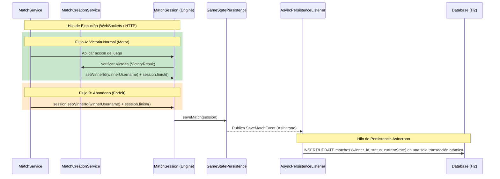

# Documentación Técnica del Módulo: Rankings e Historial de Partidas

Esta documentación consolida el diseño final, la arquitectura, las decisiones técnicas y las estrategias de mitigación aplicadas durante la implementación del módulo de Rankings e Historial de Partidas (Fases 1 a 4).

---

## 1. Arquitectura General y Flujo de Datos

El diseño sigue una arquitectura desacoplada y orientada a eventos asíncronos para no bloquear el hilo de ejecución de sockets del jugador. Sin embargo, para garantizar la consistencia, el pipeline de guardado del ganador está completamente unificado de forma atómica.



---

## 2. Decisiones Técnicas y Resolución de Bugs Críticos

### A. Evasión de la Hidratación de `MatchEntity` y `currentState`
*   **Problema:** La columna `matches.current_state` es un JSON de gran tamaño (`length = 100000`) mapeado con conversión EAGER. Realizar consultas que retornen instancias de `MatchEntity` obliga a Hibernate a leer y deserializar esta columna por cada registro retornado, provocando picos críticos de consumo de CPU y memoria.
*   **Solución:** Se prohibieron consultas que retornen la entidad. Tanto rankings como historiales utilizan **Constructor Projections en JPQL** (`SELECT new ar.edu.utn.frc.tup.piii.dtos.RankingDto(...)`). Hibernate ejecuta un `SELECT` seleccionando estrictamente las columnas requeridas (joins de nombres de usuario e id) e instancia directamente las clases Java Record sin pasar por el estado gestionado de persistencia.

### B. Prevención del Problema N+1
*   **Problema:** Al consultar historiales que contienen relaciones `Lazy` hacia `player1`, `player2` y `winner`, intentar leer los nombres de usuario en un bucle en memoria fuerza a Hibernate a lanzar una consulta SQL por cada relación no cargada, resultando en $3 \times N + 1$ queries.
*   **Solución:** La query de historial realiza `LEFT JOIN` nativos en la base de datos dentro del JPQL:
    ```sql
    FROM MatchEntity m LEFT JOIN m.player1 p1 LEFT JOIN m.player2 p2 LEFT JOIN m.winner w
    ```
    Los campos de texto (`p1.username`, etc.) son extraídos en la misma consulta única y pasados directamente a un DTO inmutable. El problema de consultas N+1 se reduce a exactamente cero.

### C. Pipeline Unificado y Atómico (Resolución de Race Conditions)
*   **Pipeline Anterior (Descartado):** Originalmente, el ganador se declaraba en paralelo a través de un evento separado (`MatchWinnerEvent`) y una query de actualización atómica directa (`updateWinnerIfNull`). Este enfoque presentaba dos fallos graves:
    1. **Overwrite por Dirty Checking:** Al ejecutarse en transacciones independientes concurrentes, el flush de `onSaveMatch` (que cargaba la entidad con `winner = null`) sobrescribía y destruía el ganador que el hilo paralelo de victorias acababa de persistir.
    2. **Carrera de Orden:** Si `onMatchWinner` se ejecutaba antes de que se completara el `INSERT` inicial del match, el UPDATE afectaba a `0` filas, perdiendo el ganador permanentemente de forma silenciosa.
*   **Nuevo Pipeline Atómico (Implementado):** Se descartó por completo `MatchWinnerEvent` y la query `updateWinnerIfNull`.
    1. El `winnerId` se encapsula directamente en el objeto `MatchSession` (tanto en victorias por motor como por abandono).
    2. Jackson serializa y deserializa esta propiedad dentro de la columna JSON `currentState` de la base de datos (configurado explícitamente en el serializador custom `MatchSessionJsonConverter`).
    3. En `AsyncPersistenceListener.onSaveMatch`, la entidad de base de datos se guarda o actualiza incluyendo al ganador de manera unificada y atómica en una sola sentencia SQL. Se eliminó la concurrencia destructiva de Hibernate y se garantizó la consistencia de datos de extremo a extremo.

### D. Paginación mediante `Slice` para Evitar Count Queries
*   **Problema:** Usar `Page<T>` en Spring Data obliga a calcular el total de elementos y páginas a través de un `SELECT COUNT(*)` en cada página, requiriendo un escaneo total de tablas que se degrada drásticamente en producción.
*   **Solución:** Se utiliza **`Slice<T>`** en todos los endpoints públicos. `Slice` carga `limit + 1` elementos para evaluar de forma binaria si existe una página posterior, eliminando la query de conteo del servidor.

### E. Bean Global de `RestClient.Builder`
*   **Problema:** El backend no lograba iniciar debido a un error de cableado de dependencias (`NoSuchBeanDefinitionException`) en `RestClientPokemonTcgApiClient` al requerir un `RestClient.Builder` que no estaba expuesto en el contexto.
*   **Solución:** Se declaró el bean `@Bean` de `RestClient.Builder` en la clase principal [Application.java](file:///c:/Users/Usuario/OneDrive/Documentos/GitHub/tpi-pokemon-2w1-15/BE/src/main/java/ar/edu/utn/frc/tup/piii/Application.java) para levantar el contexto del servidor sin dependencias fallidas.

### F. Cifrado de Contraseñas en el Seeder (Seguridad en Desarrollo)
*   **Problema:** Al iniciar la aplicación en el perfil `dev`, los usuarios de prueba (`player-alice`, `player-bob`, etc.) se sembraban con la contraseña `"dummy"` en texto plano en la base de datos H2. Esto provocaba que el flujo de autenticación de Spring Security rechazara el login de autenticación al intentar comparar el hash de base de datos con la entrada de texto.
*   **Solución:** Se inyectó `PasswordEncoder` en [DatabaseSeeder.java](file:///c:/Users/Usuario/OneDrive/Documentos/GitHub/tpi-pokemon-2w1-15/BE/src/main/java/ar/edu/utn/frc/tup/piii/loader/DatabaseSeeder.java) para codificar la contraseña `"dummy"` antes de persistirla en base de datos. De esta forma, el flujo de autenticación de JWT puede validar las credenciales con éxito en entornos de prueba locales.

---

## 3. Endpoints Implementados

### A. Leaderboard (Ranking Global)
*   **Path:** `GET /api/rankings?page=0&size=10`
*   **Respuesta:** `Slice<RankingDto>`
*   **Seguridad:** Configurado con **`.requestMatchers("/api/rankings").permitAll()`** en [SecurityConfig.java](file:///c:/Users/Usuario/OneDrive/Documentos/GitHub/tpi-pokemon-2w1-15/BE/src/main/java/ar/edu/utn/frc/tup/piii/configs/SecurityConfig.java) para permitir su consulta de forma pública y anónima. Valida parámetros negativos (page < 0, size < 1) y limita el tamaño máximo de página (`cappedSize = 50`) para evitar consultas excesivas de memoria.
*   **Estructura del DTO:**
    ```java
    public record RankingDto(String username, Long wins) {}
    ```

### B. Historial de Partidas Autenticado
*   **Path:** `GET /api/users/me/history?page=0&size=10`
*   **Respuesta:** `Slice<MatchHistoryDto>`
*   **Seguridad:** Endpoint protegido. Extrae al usuario autenticado de forma segura a través de `@AuthenticationPrincipal UserDetails`, eliminando la exposición de IDs numéricos en la URL. Valida y limita la paginación a `50` elementos de manera idéntica al ranking.
*   **Semántica Resolutiva (En capa de servicio):**
    *   `ACTIVE` $\rightarrow$ `IN_PROGRESS`
    *   `FINISHED` + `winner_id IS NULL` $\rightarrow$ `TIE`
    *   `FINISHED` + `winner_id == currentUser` $\rightarrow$ `VICTORY`
    *   `FINISHED` + `winner_id != currentUser` $\rightarrow$ `DEFEAT`
*   **Estructura del DTO:**
    ```java
    public record MatchHistoryDto(Long matchId, String opponent, String status, String result, LocalDateTime date) {}
    ```

---

## 4. Estrategia de Testing

El módulo cuenta con cobertura total a tres niveles para certificar la estabilidad de cada fase:
1.  **Integración H2 (`MatchPersistenceTest`):** Valida la integración real asíncrona del listener con la base de datos de H2, corroborando el ordenamiento descendente (DESC) de rankings, la persistencia atómica del ganador a través de `saveMatch` y la consistencia en la deserialización de `winnerId`.
2.  **Mapeo Semántico (`HistoryServiceTest`):** Test unitario que valida que el servicio resuelva correctamente los resultados de victorias, derrotas, empates y partidas en progreso.
3.  **Controlador MockMvc (`RankingControllerTest` / `HistoryControllerTest`):** Pruebas de standalone mockmvc que verifican el retorno correcto de estados HTTP (`200 OK` para Slices exitosos, `400 Bad Request` ante entradas inválidas) y la inyección correcta del principal de seguridad mediante resolvedores de argumentos Mock.

---

## 5. Deuda Técnica Restante

### A. Índice en `matches.created_at` (Bajo Riesgo)
*   **Problema:** La tabla de partidas no tiene un índice de base de datos sobre la columna de fecha. A gran escala, ordenar el historial del jugador por fecha (`ORDER BY m.createdAt DESC`) realizará table scans. En producción, se recomienda crear un índice indexado compuesto:
    ```sql
    CREATE INDEX idx_matches_created_at_desc ON matches(created_at DESC);
    ```
    *(No implementado en esta rama respetando la restricción de no alterar los esquemas migratorios existentes).*

### B. Hidratación en Replays (`ReplayServiceImpl`) (Severidad Alta en Producción)
*   **Problema:** El servicio legacy de replays (`ReplayServiceImpl`) carga entidades completas de `MatchEntity` en `getReplay` and `getUserMatchHistory`, lo que obliga a Hibernate a leer y deserializar el JSON gigante de `currentState` de 100KB para todos los matches de la lista.
*   **Impacto:** En producción real, provocará degradación de performance y picos de consumo de CPU/memoria (Memory Bloat) al consultar historiales legacy.
*   **Solución recomendada:** Migrar el método `ReplayServiceImpl.getUserMatchHistory` a proyecciones JPQL directas (DTO projections) de la misma forma que el historial de la Fase 4.
