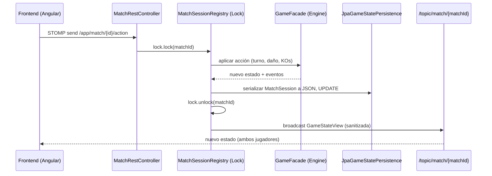

# Arquitectura y Flujo de Datos (AI-Friendly Context)

## Propósito de este Documento
Este archivo detalla la arquitectura para que herramientas LLM y agentes de desarrollo entiendan rápidamente dónde y cómo inyectar código nuevo sin romper patrones existentes. 

## 1. Stack Tecnológico Estricto
- **Backend:** Java 21 (usa Pattern Matching, Records y Virtual Threads si aplica), Spring Boot 4.0.0, Spring Security + JWT.
- **Frontend:** Angular 21+ (Signals nativos, control flow `@if/@for`, Standalone Components).
- **Persistencia:** PostgreSQL en prod, H2 en memoria para los tests locales. JPA/Hibernate manejando entidades, y Flyway para migraciones.

## 2. Inyección de Dependencias (DI) Circular Constraints
- Muchos servicios de dominio tienen referencias mutuas (ej. `MatchService` llama a `ProfileService` al terminar el match, y `BotDecisionService` llama a `MatchService` para ejecutar acciones).
- **Regla AI:** Si agregás dependencias en el constructor de `MatchService`, SIEMPRE verificá si causás una dependencia circular. Si es así, utilizá `@Lazy` en la inyección.

## 3. Game Engine: El Flujo STOMP (WebSockets)
La arquitectura del juego es **Server-Authoritative**. El Frontend NUNCA altera el estado localmente, solo emite intenciones.
1. **Frontend emite:** `stompClient.send("/app/match/{matchId}/action", actionPayload)`
2. **Backend recibe (`GameWebSocketController.handleAction`):** Método anotado `@MessageMapping("/match/{matchId}/action")`. Toma el payload, verifica JWT y delega a `MatchService.processAction(...)`.
3. **Locking Concurrente (`MatchSessionRegistry.java`):** El `MatchService` solicita un `ReentrantLock` por `matchId` para asegurar concurrencia transaccional (ej: si dos jugadores juegan cartas exactamente al mismo milisegundo).
4. **Mutación de Estado (`GameFacade.java`):** El motor principal. Valida que el turno pertenezca al jugador y aplica la lógica TCG (damage, status conditions, prizes).
5. **Persistencia dentro del Lock (`JpaGameStatePersistence.java`):** Todo el objeto gigantesco `MatchSession` (la memoria RAM de la mesa de juego) se convierte a JSON (`MatchSessionJsonConverter`) y se hace UPDATE a la base de datos `MatchEntity`.
6. **Logueo inmutable:** Se hace un insert en `MatchLogEntity` para tener el registro paso a paso.
7. **Broadcast:** Se manda la `GameStateView` (visión sanitizada del estado, escondiendo las cartas del oponente) a `/topic/match/{matchId}`.

Ver también [ADR 0002](./adr/0002-server-authoritative-websocket-sync.md) — por qué el diseño es server-authoritative y qué implica el lock por partida.

> [!WARNING]
> **Aviso para AI Agents:** Si vas a modificar el Game Engine, el código SIEMPRE debe ir dentro del bloque `try { lock.lock(); ... } finally { lock.unlock(); }` de `MatchService`. Nunca modifiques la sesión por fuera del lock.

## 4. Frontend Smart/Dumb Component Pattern
Todo el frontend usa un patrón estricto para evitar archivos `.ts` monstruosos.
- **Servicios (Signals):** `GameStateService` mantiene el estado. NINGÚN COMPONENTE usa RxJS localmente, todo es `.set()` o `.update()`.
- **Smart Components:** `GameBoardComponent`. Es el único que inyecta el `MatchWebSocketService` y `GameStateService`.
- **Dumb Components:** Todo lo demás (`CardComponent`, `PlayerHandComponent`, `PrizeStackComponent`). Usan `@Input()` y `@Output()`. NO saben de la existencia de la red ni del STOMP.

## 5. Convenciones de Código
- **Backend:** si hay un `if/else` gigante para efectos de cartas, está mal diseñado — usar Strategy pattern (`Map<Enum/String, FunctionalInterface>`), mismo patrón ya aplicado en `GameFacade`/`RuleValidator`/`CardMapper`/`AttackEffectResolver`. El engine (`engine/`) nunca depende de Spring/JPA/WebSockets — ver [ADR 0001](./adr/0001-hexagonal-engine-isolation.md).
- **Testing:** obligatorio para lógica de validación de reglas y efectos; ver la estrategia de testing real (qué capa cubre qué) en `docs/03_guia_desarrollo_y_setup.md`.
- **Frontend:** Componentes Standalone exclusivamente. Usar Signals (`signal()`, `computed()`) y el control flow nativo (`@if`, `@for`) — no `*ngIf`/`*ngFor`. Interfaces estrictas para los payloads que vienen del backend.
- **Commits:** Conventional Commits (`feat`/`fix`/`docs`/`refactor`/`test`/`chore`), mensaje explicando el POR QUÉ, no solo el QUÉ.
