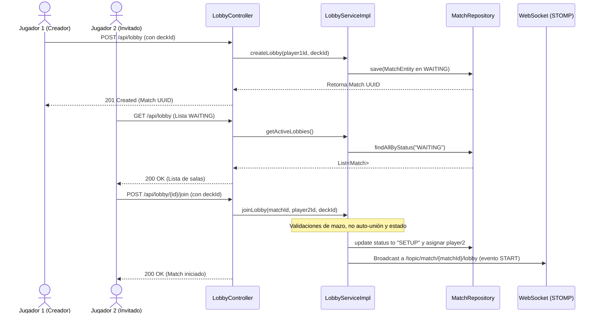
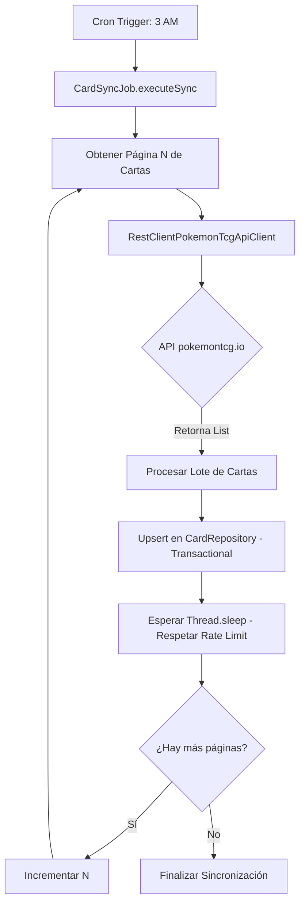
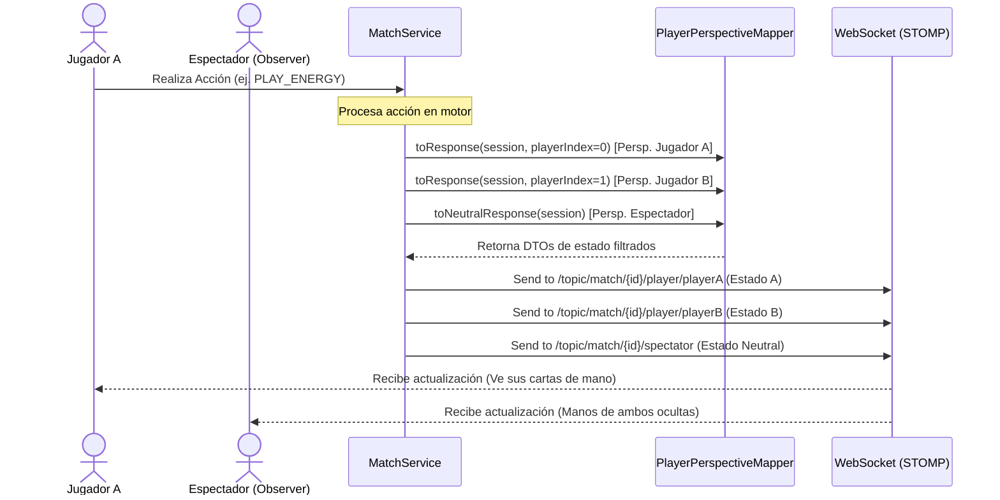
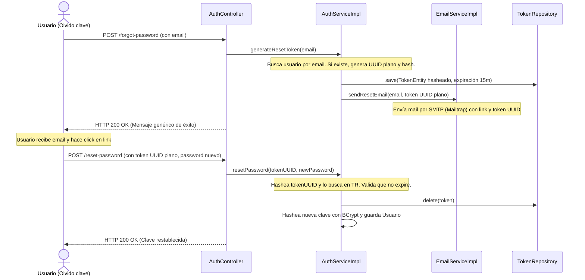

# Documento de Especificación de Diseño Técnico (SDD) - Backlog Pendiente

Este documento contiene las especificaciones detalladas de arquitectura y diseño paso a paso para las **4 tareas no iniciadas** del backend del proyecto Pokémon TCG. Está estructurado como un Documento de Diseño de Software (SDD) para que cualquier desarrollador o asistente de IA pueda comprender con precisión el contexto, los flujos, las dependencias y las reglas de negocio a aplicar.

---

## 📋 Índice de Tareas Pendientes
- `[ ]` Tarea A: Lobby y Matchmaking (Sistema de Salas de Espera)
- `[ ]` Tarea B: Sincronizador Automático de Expansiones (pokemontcg.io)
- `[ ]` Tarea C: Modo Espectador (Observer Pattern)
- `[ ]` Tarea D: Recuperación de Contraseña con Spring Mail

---

## Tarea A: Lobby y Matchmaking (Sistema de Salas de Espera)

### 1. Objetivo del Diseño
Permitir el emparejamiento dinámico de dos jugadores mediante la creación de salas virtuales en estado `WAITING`. El flujo garantiza el registro de salas de espera, la consulta de oponentes disponibles, y el inicio automático del setup del juego al completarse la sala, notificando a través de WebSockets en tiempo real.

### 2. Componentes y Arquitectura
- **Capa del Controlador**: 
  - [LobbyController.java](file:///c:/Users/Usuario/OneDrive/Documentos/GitHub/tpi-pokemon-2w1-15/BE/src/main/java/ar/edu/utn/frc/tup/piii/controllers/LobbyController.java) (REST).
- **Capa de Servicios**:
  - `LobbyService.java` (Interfaz) y `LobbyServiceImpl.java` (Implementación) en `ar.edu.utn.frc.tup.piii.services`.
- **Capa de Persistencia**:
  - [MatchRepository.java](file:///c:/Users/Usuario/OneDrive/Documentos/GitHub/tpi-pokemon-2w1-15/BE/src/main/java/ar/edu/utn/frc/tup/piii/persistence/repository/MatchRepository.java) (Extender con consultas personalizadas).
  - [MatchEntity.java](file:///c:/Users/Usuario/OneDrive/Documentos/GitHub/tpi-pokemon-2w1-15/BE/src/main/java/ar/edu/utn/frc/tup/piii/persistence/entity/MatchEntity.java) (Asegurar soporte de estados).
- **Mensajería**:
  - `SimpMessagingTemplate` de Spring WebSocket para notificaciones.



### 3. Modelo de Base de Datos y Migración SQL
1. **Estados del Match**: Si el tipo de dato de `status` en la tabla `matches` es un VARCHAR o un Enum, debemos asegurar que acepte `'WAITING'` y `'SETUP'`.
2. **Campos**: La tabla `matches` ya posee `player1_id` y `player2_id` (que mapean a FK de la tabla `users`). En estado `WAITING`, el campo `player2_id` debe registrarse como `NULL`.
3. **Mazo del Jugador**: Si se requiere asociar el mazo elegido a la partida antes del Setup, se deben añadir columnas temporales en `matches` (`player1_deck_id`, `player2_deck_id`) o manejarse en la sesión temporal en memoria en `MatchSessionRegistry` al transicionar a `SETUP`. 
4. **Migración Flyway**: Crear un script `Vxx__update_matches_status.sql` bajo `db/migration` si se necesita alterar restricciones de base de datos.

### 4. Especificación de Endpoints y Mensajería STOMP

#### POST `/api/lobby`
*   **Seguridad**: Autenticado mediante JWT.
*   **Request Header**: `Authorization: Bearer <token>`
*   **Request Body**:
    ```json
    {
      "deckId": 123
    }
    ```
*   **Response**: `201 Created`
    ```json
    {
      "matchId": "550e8400-e29b-41d4-a716-446655440000",
      "status": "WAITING"
    }
    ```

#### GET `/api/lobby`
*   **Seguridad**: Autenticado mediante JWT.
*   **Response**: `200 OK`
    ```json
    [
      {
        "matchId": "550e8400-e29b-41d4-a716-446655440000",
        "creatorUsername": "player-alice",
        "createdAt": "2026-05-27T21:00:00"
      }
    ]
    ```

#### POST `/api/lobby/{matchId}/join`
*   **Seguridad**: Autenticado mediante JWT.
*   **Request Body**:
    ```json
    {
      "deckId": 456
    }
    ```
*   **Response**: `200 OK`
    ```json
    {
      "matchId": "550e8400-e29b-41d4-a716-446655440000",
      "status": "SETUP"
    }
    ```

#### Mensajes por WebSocket (STOMP)
Al completar la sala (invocando exitosamente `/join`):
*   **Canal**: `/topic/match/{matchId}/lobby`
*   **Payload enviado**:
    ```json
    {
      "event": "MATCH_START",
      "matchId": "550e8400-e29b-41d4-a716-446655440000",
      "player1": "player-alice",
      "player2": "player-bob",
      "status": "SETUP"
    }
    ```

### 5. Algoritmo y Lógica de Negocio Paso a Paso

#### Flujo de Creación de Sala (`createLobby`):
1. Recuperar el identificador del usuario autenticado (`player1Id`) desde el contexto de Spring Security (`Principal.getName()`).
2. Validar mediante el servicio de mazos (`DeckService`) que el `deckId` provisto en el request pertenezca a `player1Id` y que cumpla los criterios mínimos de validación de mazo (ej. cantidad de cartas requeridas por el motor). Si no es válido, lanzar una excepción personalizada `InvalidDeckException` (que resuelva a HTTP 400).
3. Instanciar una nueva `MatchEntity` con:
   - `id`: Generado aleatoriamente (UUID).
   - `player1`: Entidad del usuario creador obtenido desde `UserRepository`.
   - `player2`: `null`.
   - `status`: `"WAITING"`.
   - `createdAt`: Timestamp del sistema.
4. Persistir la entidad a través de `MatchRepository.save()`.
5. Retornar el DTO con el ID del match creado.

#### Flujo de Unión a Sala (`joinLobby`):
1. Recuperar el ID de la partida (`matchId`) desde el Path Variable y el ID del segundo jugador (`player2Id`) desde el contexto de Spring Security.
2. Buscar la entidad `MatchEntity` por ID. Si no existe, lanzar `NoSuchElementException` (HTTP 404).
3. **Validación de Estado**: Comprobar que el estado de la partida sea estrictamente `"WAITING"`. Si es distinto, lanzar `IllegalStateException` (HTTP 400).
4. **Validación de Identidad**: Validar que el `player2Id` no sea igual al `player1.getId()` de la partida. Si coincide, lanzar `IllegalArgumentException("Cannot join your own lobby")` (HTTP 400).
5. **Validación de Mazo**: Validar que el `deckId` del segundo jugador le pertenezca y sea reglamentario.
6. **Transición**:
   - Asignar el `player2` en `MatchEntity`.
   - Modificar el estado (`status`) de la partida a `"SETUP"`.
   - Salvar la entidad en base de datos.
7. **Inicialización en Memoria**: Invocar a `MatchCreationService` para registrar el inicio de la partida en el motor en memoria (`MatchSessionRegistry` de la aplicación).
8. **WebSocket Broadcast**: Publicar el payload de inicio al tópico `/topic/match/{matchId}/lobby` para advertir a ambos clientes del inicio de la partida en tiempo real.

### 6. Estrategia de Pruebas (TDD)
- **Unitarias**:
  - Testear `joinLobby` simulando fallos en mazo (debe lanzar excepción).
  - Testear bloqueo de auto-unión (lanzar error si P1 == P2).
  - Testear transición de estados controlando que cambie de `WAITING` a `SETUP`.
- **Integración**:
  - Mockear el cliente WebSocket utilizando un STOMP Session Handler para verificar que el evento de inicio de partida llega correctamente a ambos suscriptores al llamar a `/join`.

---

## Tarea B: Sincronizador Automático de Expansiones (pokemontcg.io)

### 1. Objetivo del Diseño
Mantener la base de datos local de cartas actualizada automáticamente sincronizándose con la API pública oficial de Pokémon TCG de forma asíncrona. La sincronización se ejecutará diariamente en horas de baja demanda para realizar upserts controlando los límites de velocidad del API externo.

### 2. Componentes y Arquitectura
- **Scheduling Config**: Anotación `@EnableScheduling` en una clase de configuración en el paquete `ar.edu.utn.frc.tup.piii.configs`.
- **Job Orchestrator**: 
  - `CardSyncJob.java` en `ar.edu.utn.frc.tup.piii.loader` que contiene el método programado.
- **API Client**:
  - Extender la interfaz [PokemonTcgApiClient.java](file:///c:/Users/Usuario/OneDrive/Documentos/GitHub/tpi-pokemon-2w1-15/BE/src/main/java/ar/edu/utn/frc/tup/piii/client/PokemonTcgApiClient.java) y su implementación [RestClientPokemonTcgApiClient.java](file:///c:/Users/Usuario/OneDrive/Documentos/GitHub/tpi-pokemon-2w1-15/BE/src/main/java/ar/edu/utn/frc/tup/piii/client/RestClientPokemonTcgApiClient.java).
- **Capa de Persistencia**:
  - `CardRepository` y `CardEntity` para guardar los registros.



### 3. Modelo de Base de Datos
- La tabla de destino es la mapeada por `CardEntity` (habitualmente llamada `cards`). Debe soportar la estructura de datos importada de la API.
- Se debe asegurar que las claves primarias (`id` de la carta de la API, ej: `"xy1-1"`) actúen como clave única en base de datos para no duplicar datos ante ejecuciones consecutivas del sincronizador.

### 5. Algoritmo y Lógica de Negocio Paso a Paso

#### Flujo del Scheduler (`CardSyncJob.syncCards`):
1. Iniciar ejecución a las 3 AM (`@Scheduled(cron = "0 0 3 * * ?")`).
2. Declarar variable local `page = 1` y una bandera `hasMore = true`.
3. Iniciar un bucle `while (hasMore)`:
   - Invocar al cliente API: `pokemonTcgApiClient.fetchPage(page, 250)`.
   - Recuperar el payload de respuesta que contiene la lista de cartas y los metadatos de paginación (`totalCount`, `count`, `page`, `pageSize`).
   - Si la lista de cartas está vacía o el conteo de la página actual es menor que el `pageSize`, colocar `hasMore = false`.
   - **Proceso de Upsert Transaccional** (en un método del servicio anotado con `@Transactional`):
     - Por cada carta en la lista:
       - Buscar en la base de datos local por el `id` único de la API (ej: `"xy1-1"`).
       - Si existe, actualizar sus datos (atributos, ataques, HP, etc.) con los últimos provistos por la API.
       - Si no existe, mapear el DTO a `CardEntity` e insertarlo en la base de datos.
   - **Manejo de Rate Limit**:
     - Para evitar bloqueos (HTTP 429 Too Many Requests), añadir un retardo artificial: `Thread.sleep(2000)` (2 segundos) al final del bucle de cada página si no se cuenta con una API key premium configurada en la aplicación.
   - Incrementar `page++`.
4. Manejar excepciones de conexión (`HttpClientErrorException`, `ResourceAccessException`) de forma que registren el error en los logs pero no interrumpan la ejecución global de la aplicación Spring.

### 6. Estrategia de Pruebas
- **Mocks con WireMock**: En las pruebas de integración, levantar un servidor WireMock que intercepte las llamadas a `https://api.pokemontcg.io/v2/cards` y devuelva respuestas JSON simuladas para páginas 1 y 2.
- **Verificación de Upsert**: Correr el test de sincronización contra una base de datos en memoria (H2). Verificar que tras la primera ejecución se inserten N cartas y tras una segunda ejecución con datos modificados, el conteo total de cartas se mantenga igual y los valores se hayan actualizado.

---

## Tarea C: Modo Espectador (Observer Pattern en WebSockets)

### 1. Objetivo del Diseño
Habilitar a los usuarios de la plataforma ver el estado de partidas de terceros en tiempo real. La arquitectura debe mantener la política de "Niebla de Guerra" (War-Fog) pero modificada para observadores neutros, quienes recibirán información resumida de ambas manos sin poder realizar acciones sobre el juego.

### 2. Componentes y Arquitectura
- **Capa del Controlador**:
  - [GameWebSocketController.java](file:///c:/Users/Usuario/OneDrive/Documentos/GitHub/tpi-pokemon-2w1-15/BE/src/main/java/ar/edu/utn/frc/tup/piii/controllers/GameWebSocketController.java) (Validaciones de seguridad en recepción de acciones).
- **Capa de Servicios**:
  - [MatchService.java](file:///c:/Users/Usuario/OneDrive/Documentos/GitHub/tpi-pokemon-2w1-15/BE/src/main/java/ar/edu/utn/frc/tup/piii/services/MatchService.java) (Transmisión al canal global de espectador).
  - [PlayerPerspectiveMapper.java](file:///c:/Users/Usuario/OneDrive/Documentos/GitHub/tpi-pokemon-2w1-15/BE/src/main/java/ar/edu/utn/frc/tup/piii/services/PlayerPerspectiveMapper.java) (Crear mapeo neutral de vista).



### 3. Modelo de Mapeo de Perspectiva (War-Fog Espectador)
El objeto `GameStateResponseDTO` debe ser mapeado de la siguiente manera al transmitirse por el canal de espectador:
1. **Mano del Jugador A**: Filtrar contenido. Las cartas reales de la mano no deben exponerse; el DTO debe enviar solo el número total de cartas en mano.
2. **Mano del Jugador B**: Mismo filtrado; enviar solo la cantidad total de cartas.
3. **Tablero, Pilas de Descarte, Premios y Activos**: Visibles para ambos jugadores. Los espectadores pueden ver qué pokémon están en juego, las energías acopladas, y la cantidad de cartas de premio pendientes para cada uno.

### 4. Protocolo WebSocket (STOMP)

#### Tópico de Suscripción para Espectadores:
*   **Ruta**: `/topic/match/{matchId}/spectator`
*   **Acceso**: Permitido para cualquier usuario autenticado en la plataforma.

#### Canal de Acciones (Seguridad):
*   **Ruta de publicación**: `/app/match/{matchId}/action`
*   **Control de Acceso**:
    - Al recibir una acción en `GameWebSocketController.handleAction`:
      1. Extraer el `Principal` de la sesión WebSocket.
      2. Buscar la `MatchSession` activa en `MatchSessionRegistry`.
      3. Validar que el username obtenido del `Principal` sea igual a `session.getPlayerIdA()` o `session.getPlayerIdB()`.
      4. Si el username no coincide con ninguno, abortar la transacción lanzando un error de tipo `AccessDeniedException` o `IllegalArgumentException` y evitar que llegue al motor de juego.

### 5. Algoritmo y Lógica de Negocio Paso a Paso

#### Flujo de Difusión de Estado (`MatchService.broadcastState`):
1. Obtener la sesión activa de la partida.
2. Generar el DTO para el Jugador 1 (`viewA`) pasando `playerIndex = 0` al mapeador.
3. Generar el DTO para el Jugador 2 (`viewB`) pasando `playerIndex = 1` al mapeador.
4. **Mapeo Neutral**: Invocar una nueva función `perspectiveMapper.toNeutralResponse(session)`:
   - Crear una copia profunda del estado del juego.
   - Para el jugador 0 y el jugador 1: vaciar las colecciones detalladas de sus manos (`hand.cards`), reemplazándolas por una lista vacía o nula, pero preservando el campo numérico `handSize` en el DTO resultante.
5. Enviar los mensajes a través de `SimpMessagingTemplate`:
   - `messaging.convertAndSend("/topic/match/" + matchId + "/player/" + playerIdA, viewA)`
   - `messaging.convertAndSend("/topic/match/" + matchId + "/player/" + playerIdB, viewB)`
   - `messaging.convertAndSend("/topic/match/" + matchId + "/spectator", neutralView)` (Canal global de observadores).

### 6. Estrategia de Pruebas
- **Validación de Datos**: Escribir pruebas unitarias sobre `PlayerPerspectiveMapper` verificando que la respuesta neutral no contenga ninguna instancia de `Card` dentro de las colecciones de la mano de ninguno de los dos jugadores.
- **Validación de Seguridad**: Escribir un test de integración para `GameWebSocketController` en el cual un usuario autenticado alternativo intente enviar una acción sobre un `matchId` activo, comprobando que se eleva la excepción de seguridad y que el estado de la sesión de juego en memoria no sufre alteraciones.

---

## Tarea D: Recuperación de Contraseña con Spring Mail

### 1. Objetivo del Diseño
Habilitar a los usuarios restablecer sus contraseñas olvidadas de manera segura. El diseño define un flujo asíncrono donde se solicita un token único temporal enviado por correo SMTP, el cual valida la identidad del usuario antes de permitir la actualización de la contraseña hasheada.

### 2. Componentes y Arquitectura
- **Capa del Controlador**:
  - `AuthController.java` (Agregar endpoints `/forgot-password` y `/reset-password`).
- **Capa de Servicios**:
  - `AuthService` y `AuthServiceImpl` (Lógica de orquestación, validación de expiración y persistencia de tokens).
  - `EmailService.java` y su implementación `EmailServiceImpl.java` (Encapsulación de `JavaMailSender` de Spring Boot Starter Mail).
- **Capa de Persistencia**:
  - `PasswordResetTokenEntity.java` (Entidad de JPA).
  - `PasswordResetTokenRepository.java` (Interfaz de persistencia).



### 3. Diseño de Base de Datos y Migración (Flyway)
Crear un archivo de migración `Vxx__create_password_reset_token.sql` en `resources/db/migration/`:
```sql
CREATE TABLE password_reset_tokens (
    id BIGSERIAL PRIMARY KEY,
    user_id BIGINT NOT NULL,
    token_hash VARCHAR(255) NOT NULL UNIQUE,
    expiry_date TIMESTAMP NOT NULL,
    CONSTRAINT fk_password_reset_user FOREIGN KEY (user_id) REFERENCES users(id) ON DELETE CASCADE
);
```

### 4. Especificación de Endpoints y Configuración

#### Dependencias (pom.xml)
Añadir la dependencia requerida en [pom.xml](file:///c:/Users/Usuario/OneDrive/Documentos/GitHub/tpi-pokemon-2w1-15/BE/pom.xml):
```xml
<dependency>
    <groupId>org.springframework.boot</groupId>
    <artifactId>spring-boot-starter-mail</artifactId>
</dependency>
```

#### POST `/api/auth/forgot-password`
*   **Request Body**:
    ```json
    {
      "email": "user@example.com"
    }
    ```
*   **Response**: `200 OK` (Tanto si el correo existe como si no, devolviendo la misma respuesta genérica por seguridad):
    ```json
    {
      "message": "Si el email ingresado está registrado, se enviará un enlace para restablecer la contraseña."
    }
    ```

#### POST `/api/auth/reset-password`
*   **Request Body**:
    ```json
    {
      "token": "d8b3c612-40a2-4a00-8cb4-3e9a4f669da7",
      "newPassword": "SecurePassword123!"
    }
    ```
*   **Response**: `200 OK`
    ```json
    {
      "message": "La contraseña ha sido actualizada con éxito."
    }
    ```
*   **Response (Errores)**: `400 Bad Request` si el token expiró, no existe o ya fue usado.

### 5. Algoritmo y Lógica de Negocio Paso a Paso

#### Flujo de Solicitud de Recuperación (`forgotPassword`):
1. Recibir el correo electrónico de la solicitud.
2. Consultar al `UserRepository` buscando por email.
3. Si el usuario **no existe**:
   - Detener el flujo y retornar inmediatamente HTTP 200 con el mensaje genérico (evita enumeración de usuarios).
4. Si el usuario **sí existe**:
   - Generar un token aleatorio seguro: `UUID.randomUUID().toString()`.
   - Hashear el token generado usando una función hash segura (ej. SHA-256 o BCrypt) antes de guardarlo. **Mejor práctica**: Nunca almacenar tokens de recuperación en texto plano en la base de datos para prevenir secuestros si la base de datos se ve comprometida.
   - Instanciar `PasswordResetTokenEntity` configurando el token hasheado, el usuario asociado, y la fecha de expiración (`LocalDateTime.now().plusMinutes(15)`).
   - Salvar en base de datos usando `PasswordResetTokenRepository`.
   - Construir el cuerpo del correo con el enlace que apunte a la interfaz web, adjuntando el token UUID en texto plano como parámetro de consulta: `https://tupokemontcg.com/reset-password?token=UUID_PLANO`.
   - Enviar el correo electrónico mediante `EmailService` invocando a `JavaMailSender.send()`.
   - Retornar HTTP 200 con el mensaje genérico.

#### Flujo de Confirmación y Restablecimiento (`resetPassword`):
1. Recibir el token UUID plano y la nueva contraseña.
2. Hashear el token UUID plano recibido con la misma función hash del paso anterior para poder compararlo.
3. Buscar la entidad del token en base de datos mediante su hash. Si no existe, lanzar `IllegalArgumentException("Token inválido")`.
4. **Validación de Expiración**: Verificar si `tokenEntity.getExpiryDate().isBefore(LocalDateTime.now())`. Si expiró, eliminar el token de la base de datos y lanzar `IllegalArgumentException("El token ha expirado")`.
5. **Actualización de Clave**:
   - Recuperar al usuario asociado al token.
   - Hashear la nueva contraseña con el encoder del sistema (`passwordEncoder.encode(newPassword)`).
   - Asignar la contraseña codificada al usuario y salvar al usuario en `UserRepository`.
6. **Limpieza**: Borrar el token utilizado de la base de datos para impedir que pueda volver a ser reutilizado (`passwordResetTokenRepository.delete(tokenEntity)`).

### 6. Estrategia de Pruebas
- **Unitarias**:
  - Mockear `JavaMailSender` y comprobar que se invoca su método `send` con los parámetros y correo destinatario esperados.
  - Verificar que al re-enviar una solicitud para un usuario existente, se reemplace o se genere un nuevo registro de token.
  - Comprobar que tras usar un token válido para restablecer la contraseña, este es eliminado de la base de datos de manera definitiva.
- **De Integración**:
  - Enviar requests HTTP simulados a los endpoints, controlando que no se expongan detalles sobre la existencia o no de las direcciones de email.
